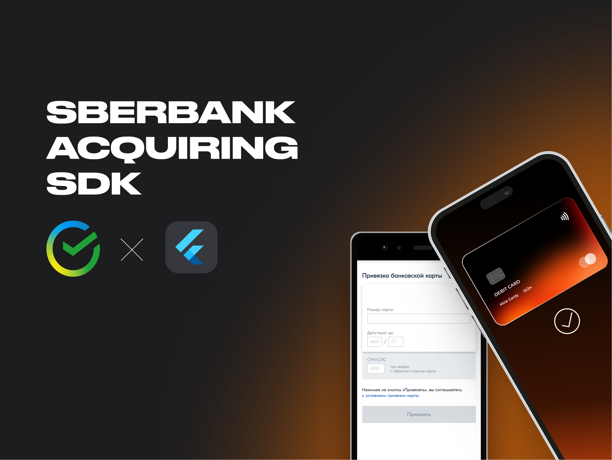

<a href="https://madbrains.ru/?utm_source=gthb"></a>
</a>

<h1 align="center">Flutter Sberbank Acquiring SDK</h1>

Acquiring SDK позволяет интегрировать [Интернет-Эквайринг Sberbank][acquiring] в мобильные приложения для платформы iOS и Android. 

[Документация по доступным API][documentation].

<p><h4> Мы создаем мобильные приложения и корпоративные сервисы, реализуем сложные IT-проекты для крупного и среднего бизнеса.</h4>
<a href="https://madbrains.ru/?utm_source=gthb">
</a>
</p>
<p><h5>Подпишитесь на обновления:</h5>
<a href="https://github.com/MadBrains" >
</a></p>
</br>


## Возможности SDK

- Проведение платежей (в том числе рекуррентных);
- Проведение платежей через Apple Pay или Google Pay (в том числе рекуррентных);
- Связанные платежи;
- Интеграция с онлайн-кассами;

## Подключение
Для подключения добавьте в файл pubspec.yaml зависимости:
```yaml
dependencies:
  sberbank_acquiring: <lastles>
```

## Подготовка к работе

Для начала работы с SDK вам понадобятся:
* **userName** - Логин служебной учётной записи продавца; 
* **password** - Пароль служебной учётной записи продавца;
* **token** – Значение, которое используется для аутентификации продавца при отправке запросов в платёжный шлюз. При передаче этого параметра параметры `userName` и `pаssword` передавать не нужно. Чтобы получить открытый ключ, обратитесь в техническую поддержку.

Данные выдаются в личном кабинете после подключения к [Интернет-Эквайрингу][acquiring].

SDK позволяет настроить режим работы (debug/prod), по умолчанию - режим debug.
Также SDK позволяет настраивать проксирование запросов, по умолчанию все запросы идут на сервера Sberbank.

Чтобы настроить режим работы, установите параметры:
```dart
final SberbankAcquiring acquiring = SberbankAcquiring(
  SberbankAcquiringConfig.credential(
    userName: userName,
    password: password,
    isDebugMode: false,
  ),
);
```

Если вы хотите использовать `token`, то воспользуйтесь следующим конструктором:
```dart
final SberbankAcquiring acquiring = SberbankAcquiring(
  SberbankAcquiringConfig.token(
    token: token,
    isDebugMode: false,
  ),
);
```

Если вы хотите использовать `proxy`, то воспользуйтесь следующим конструктором:
```dart
final SberbankAcquiring acquiring = SberbankAcquiring(
  SberbankAcquiringConfig.proxy(
    proxyDomain: 'server.com',
    proxyPath: 'api/v1/',
    globalHeaders: <String, String>{'auth': 'test'},
    mapping: (AcquiringRequest request, bool isDebugMode) {
      if(request is RegisterRequest) return ProxyMapping(path: '/register');
      return;
    }
  ),
);
```

## Пример работы

Пример работы SDK доступен в [Example][example]


[documentation]: https://securepayments.sberbank.ru/wiki/doku.php/integration:api:rest:start
[acquiring]: https://securepayments.sberbank.ru/wiki/doku.php/main_page
[example]: https://github.com/MadBrains/Sberbank-Acquiring-SDK-Flutter/tree/main/example/